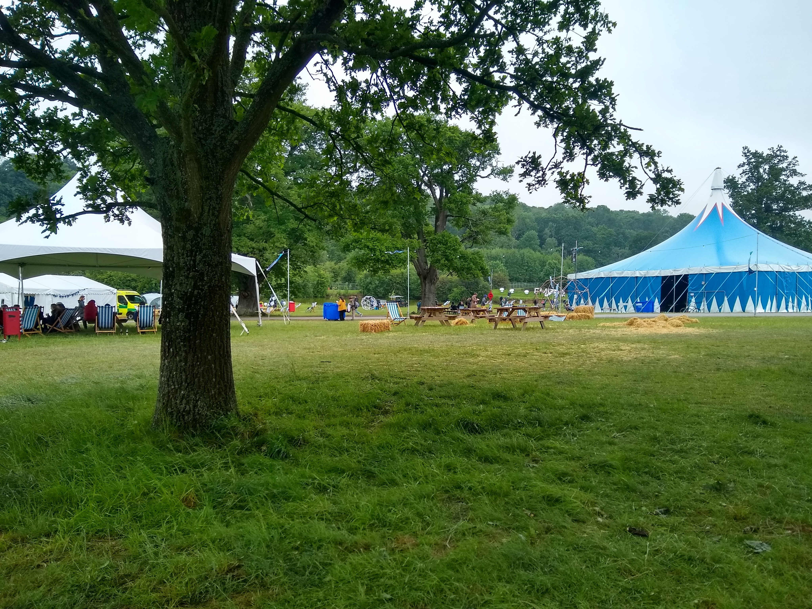

## Overview

At EMF 2022 we mounted fabric banners to the festoon poles and around site.

We put these up on the festoon poles using a combination of:

* Rubber lined pipe clamp
* M8 threaded rod
* M8 plastic domed nut

We put a number of banners up before it became clear that there was a
problem with this approach. We only fixed the banners at the top of the
fabric which resulted in the banners wrapping around the pole or the
festoon. In many cases the pipe clamp holding the M8 threaded rod bent
resulting in the banner drooping from horizontal.

## Print Settings

Settings for these parts in PrusaSlicer.
