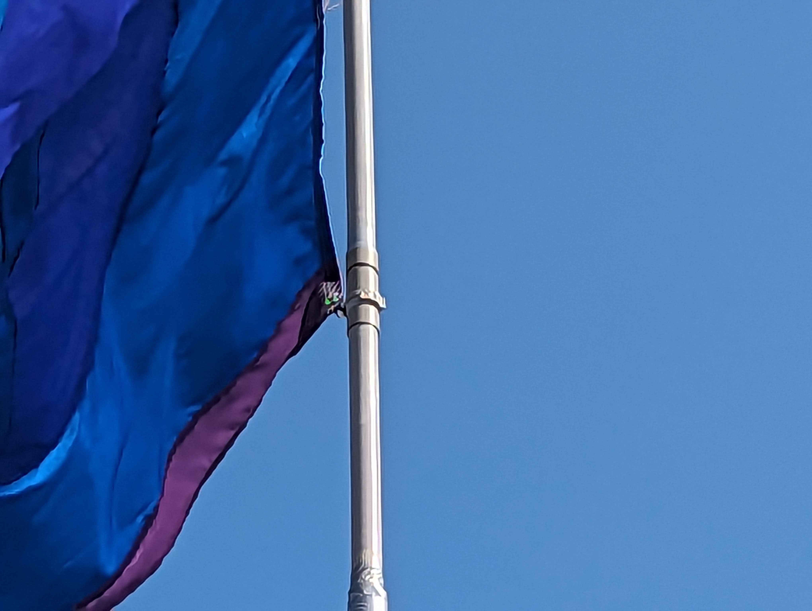

## Overview

At EMF 2022 we mounted fabric banners to the festoon poles and around site.

We put these up on the festoon poles using a combination of:

* Rubber lined pipe clamp
* M8 threaded rod
* M8 plastic domed nut

We put a number of banners up before it became clear that there was a
problem with this approach. We only fixed the banners at the top of the
fabric which resulted in the banners wrapping around the pole or the
festoon. In many cases the pipe clamp holding the M8 threaded rod bent
resulting in the banner drooping from horizontal.

Second fix was to add a piece of gorilla tape to the bottom corner of the
banner along with an eyelet, this was fixed to the pole using a loose
cable tie. This would have worked for the whole event had there not been
quite a lot of wind which ripped the eyelet out of the material resulting
in the same issue as described and shown above.

## Possible solutions

### The Glasonbury approach

Glastonbury photos with thanks to Russ Garrett

### Commercial lamp post Bracket

https://www.theprint-shop.uk/shop/banners/lamp-post-banners/

## 3d printed banner pole

## Print Settings

Settings for these parts in PrusaSlicer.
